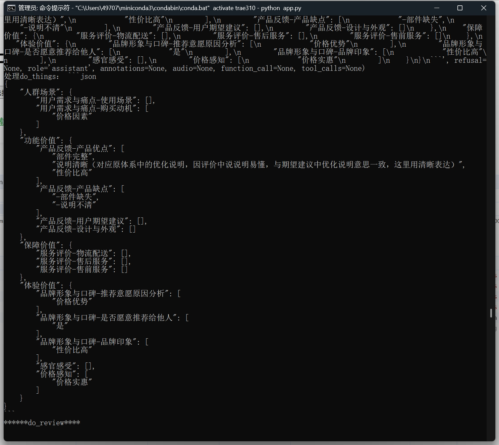
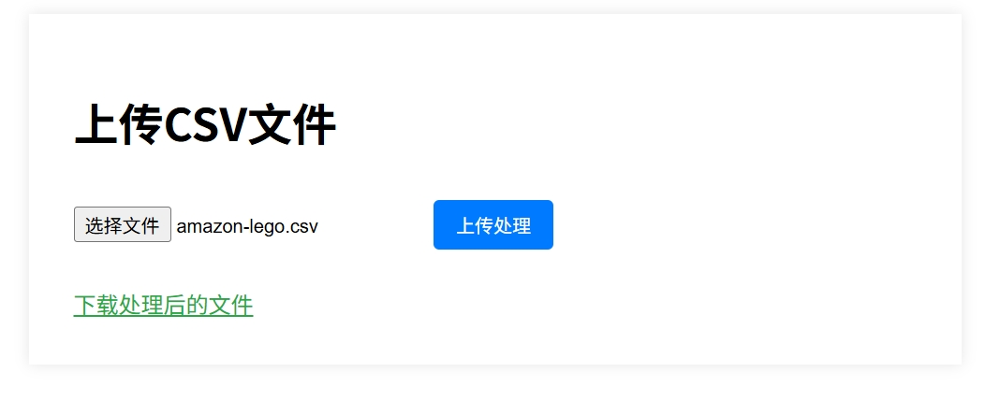
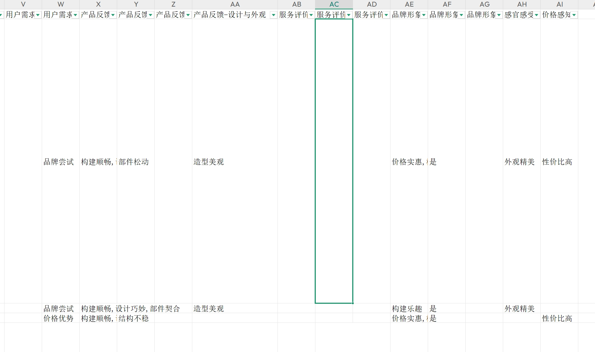
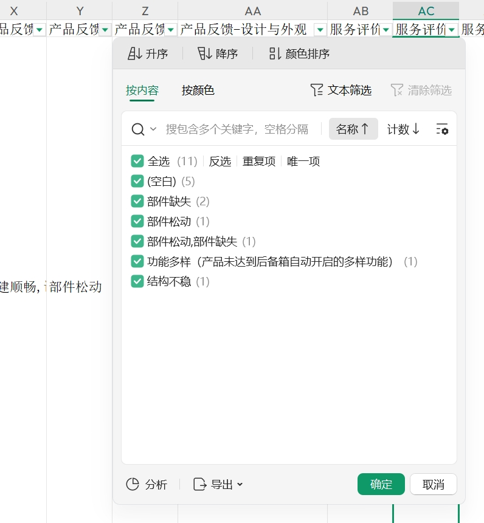
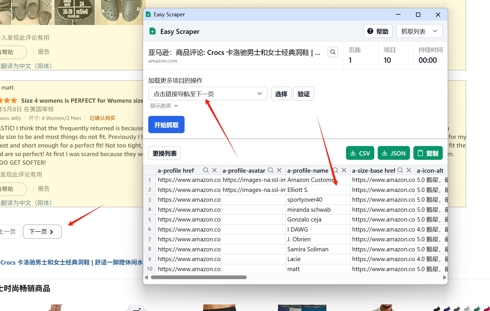

# 试试做一个 shulex VOC（客户之声）
这是一个针对amazon商品评论进行AI大模型分析的项目。利用AI对评论进行多维度的数据分析。操作流程为：用户利用easy scraper浏览器插件爬取amazon商品评论，然后直接上传csv文件到系统，系统进行评论分析，然后提供下载链接，下载更新的带有评论分析的csv文件。
## 项目结构
```
.
├── README.md
├── app.py
├── requirements.txt
├── templates
│   ├── index.html
│   └── result.html
└── static
    └── styles.css
```
## 环境准备
1. 安装Python 3.10
2. 安装依赖
```bash
pip install -r requirements.txt
```
## 运行项目
```bash
python app.py
```
 
## 示例图
### 运行python处理中：


每一个review 标签分析得到的json： 
```json
{
    "人群场景": {
        "用户需求与痛点-使用场景": [
            "汽车爱好者",
            "儿童玩乐",
            "成人收藏",
            "节日礼物"
        ],
        "用户需求与痛点-购买动机": [
            "价格优势",
            "设计喜欢",
            "替代乐高"
        ]
    },
    "功能价值": {
        "产品反馈-产品优点": [
            "零件齐全",
            "组装容易",
            "设计精美",
            "功能多样",
            "细节丰富"
        ],
        "产品反馈-产品缺点": [
            "零件缺失",
            "零件松动",
            "组装困难",
            "指示不明",
            "零件变形",
            "零件质量差"
        ],
        "产品反馈-用户期望建议": [
            "优化指示",
            "提升质量",
            "改进包装"
        ],
        "产品反馈-设计与外观": [
            "整体造型",
            "内部细节",
            "颜色搭配"
        ]
    },
    "保障价值": {
        "服务评价-物流配送": [
            "配送速度"
        ],
        "服务评价-售后服务": [
            "补发零件",
            "退款处理"
        ],
        "服务评价-售前服务": [
            "信息咨询"
        ]
    },
    "体验价值": {
        "品牌形象与口碑-推荐意愿原因分析": [
            "性价比高",
            "组装乐趣"
        ],
        "品牌形象与口碑-是否愿意推荐给他人": [
            "是",
            "否"
        ],
        "品牌形象与口碑-品牌印象": [
            "质量一般",
            "价格实惠"
        ],
        "感官感受": [
            "外观美感",
            "零件质感"
        ],
        "价格感知": [
            "价格合理",
            "价格昂贵"
        ]
    }
}
```

### 前端用户界面（先配置好大模型api key)：




### 处理完成后得到更新的评论分析文件（带有多维度标签分析）：




### 怎样利用和进行评论分析（用excel打开，第一列进行筛选，就得到如下）：



### easy scraper 插件爬取amazon商品评论：
插件地址： https://chromewebstore.google.com/detail/cljbfnedccphacfneigoegkiieckjndh
进入amazon商品评论页面，点击插件图标，选择爬取评论，然后选择爬取的评论数量，点击开始爬取，然后点击导出，选择csv格式，导出评论。https://www.amazon.com/-/zh/product-reviews/B0014C0LUC/ref=cm_cr_dp_d_show_all_btm?ie=UTF8&reviewerType=all_reviews

直接下载所有评论，直接系统上传，什么都不用做，得到评论多维度分析结果。

### 项目所用大模型
基于openai包，所以所有兼容接口的大模型都可以使用。目前是使用了字节的大模型，但是也可以使用其他的大模型。model="doubao-1.5-pro-32k-250115", 自行配置api_key（function.py搜索CHATGPT_API_KEY）.
```python
import openai
openai.api_key = "your api key"
```

### 实现原理
1. 数据爬取：使用easy scraper浏览器插件爬取amazon商品评论。
2. 数据处理：使用python进行评论分析，分析得到多维度标签。首先对全部评论内容进行一次汇总性的标签体系建设，得到标签完整体系，然后对每个评论内容进行标签分析，得到每个评论内容的具体标签。最后，因为得到的数据结构已经可以进行其他方面的自定义数据分析，可以利用powerBi等工具轻易进行评论分析。
3. 数据展示：使用flask框架+echart进行数据展示， TODO


### 数据分析结果：
处理结果
词频分析结果
产品反馈-产品优点
产品反馈-产品优点: 1
价格实惠: 4
功能多样: 2
无缺件: 2
组装顺畅: 5
设计出色: 4
产品反馈-产品缺点
产品反馈-产品缺点: 1
后备箱难开: 1
座椅对齐不佳: 1
说明书难理解: 1
车顶不稳固: 1
部件松动: 1
部件缺失: 3
部件贴合差: 1
产品反馈-用户期望建议
产品反馈-用户期望建议: 1
加强品控: 2
提供售后信息: 1
产品反馈-设计与外观
产品反馈-设计与外观: 1
价格感知
价格感知: 1
性价比高: 5
品牌形象与口碑-品牌印象
品牌形象与口碑-品牌印象: 1
品牌形象与口碑-推荐意愿原因分析
价格低: 5
品牌形象与口碑-推荐意愿原因分析: 1
外观漂亮: 4
组装有趣: 5
品牌形象与口碑-是否愿意推荐给他人
品牌形象与口碑-是否愿意推荐给他人: 1
是: 5
感官感受
外观美观: 4
感官感受: 1
服务评价-售前服务
服务评价-售前服务: 1
服务评价-售后服务
售后处理: 1
服务评价-售后服务: 1
服务评价-物流配送
服务评价-物流配送: 1
用户需求与痛点-使用场景
-儿童玩耍: 1
儿童玩耍: 1
成人收藏: 1
礼物赠送: 1
用户需求与痛点-购买动机
价格优势: 4
用户需求与痛点-购买动机: 1


## 官方支持
如果您在使用过程中遇到任何问题，请随时联系我们的官方支持团队。您可以通过以下方式联系我们：
如果您在使用过程中遇到任何问题，请随时联系我们的官方支持团队。您可以通过以下方式联系我们：
- 邮箱EMAIL- 邮箱：497070928@qq.com
- 官网- liangdabiao.com